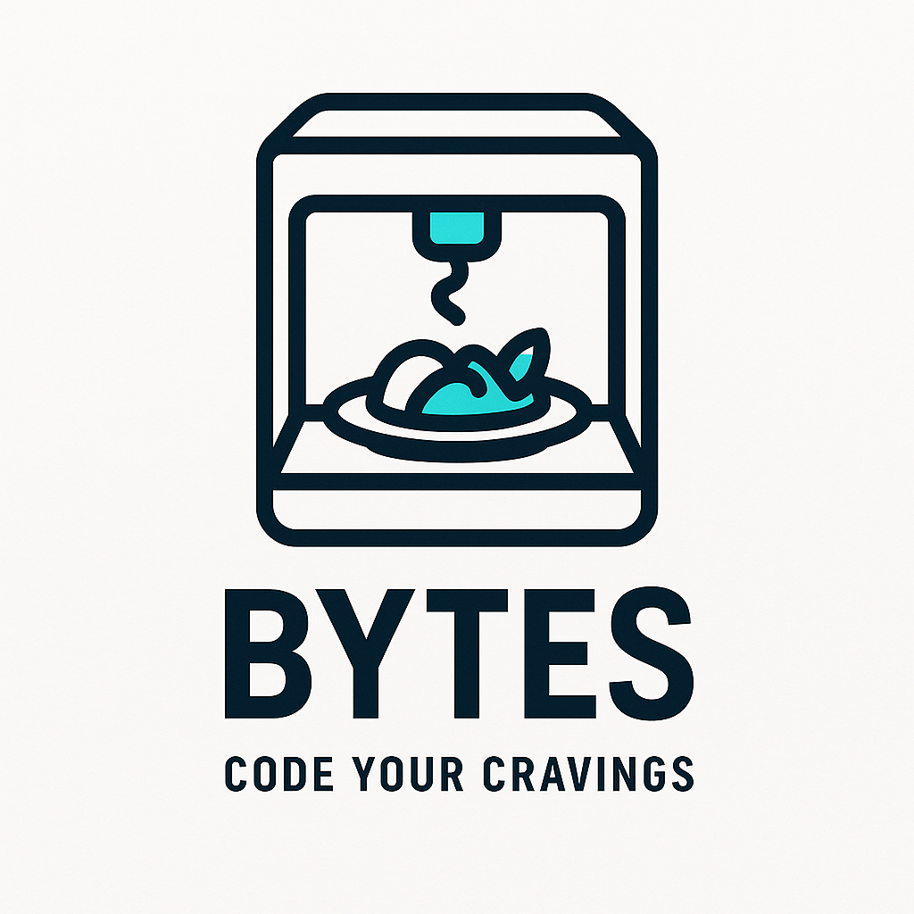
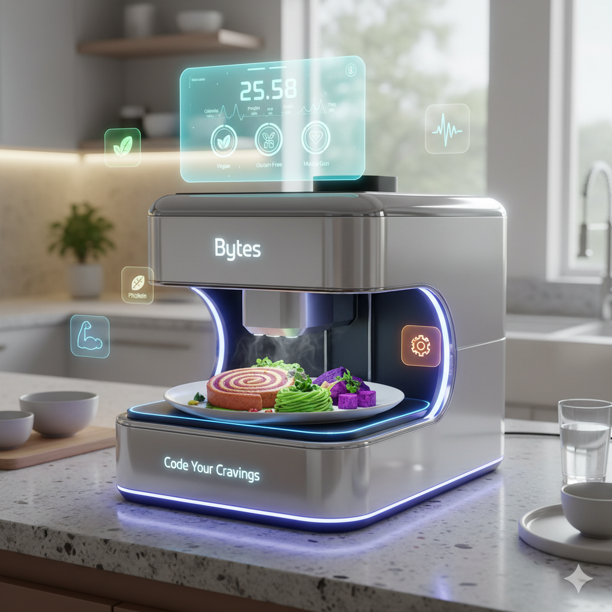

# Bytes: Code Your Cravings

## Product description: Meet Bytes

Introducing **Bytes**, the revolutionary smart food printer that transforms your kitchen into a personalized nutrition center. **Bytes** crafts perfectly portioned meals tailored to your unique health goals and dietary needs. Using advanced food-printing technology and an extensive database of chef-crafted recipes, Bytes precisely layers fresh ingredients from its safety-certified cartridge system while providing real-time nutrition tracking through its user-friendly app. Whether you're an athlete optimizing performance, managing dietary restrictions, or simply pursuing better health, Bytes seamlessly integrates with your favorite fitness apps and delivers restaurant-quality meals with the exact nutrients your body needs—all at the touch of a button.

---

## Product Features: Why You'll Love Bytes

- **Personalized Nutrition Made Simple**  
  AI adapts recipes to your dietary goals and restrictions.

- **1000+ Recipe Possibilities**  
  From protein smoothies to gourmet meals, all customizable.

- **Precision Portion Control**  
  0.1g accuracy ensures perfect servings every time.

- **Real-Time Health Dashboard**  
  Track macros, nutrients, and wellness goals with detailed charts.

- **Global Recipe Community**  
  Join 50,000+ creators sharing verified, nutritionist-approved recipes.

---

## Cooking Course Curriculum

Master the art of designing delicious, nutritionally-optimized recipes for your Bytes 3D food printer with our complimentary course. The curriculum covers:

- Ingredient selection and flavor pairing.
- Creating custom nutritional profiles.
- Achieving the perfect textures for your printed culinary creations.

---

## Customer Testimonials

*"Bytes has transformed how I approach meal prep. It's simple and fun to use, and my nutrition has never been better."*  
— Alex M., Professional Athlete

*"I've never had an easier time sticking to my dietary restrictions. Bytes is a game-changer in my kitchen!"*  
— Jamie L., Health Enthusiast

*"My family loves the variety we can now enjoy at home. It's like having a personal chef!"*  
— Patricia S., Busy Mom

---

## Reviews

> ***5 Stars - Incredible Innovation!***  
> "The precision and convenience of Bytes are unmatched. It makes achieving my fitness goals so much easier!"  
> — John D.

> ***4.5 Stars - A Must-Have for Healthy Eating***  
> "With Bytes, I can easily monitor what I eat and try new recipes every week."  
> — Rachel K.

> ***4 Stars - Great for Families***  
> "Our kids love picking out new recipes to print each week! It's educational and delicious!"  
> — Leo & Emma F.

---

For more information, visit [www.bytesfoodprinter.com](http://www.bytesfoodprinter.com)